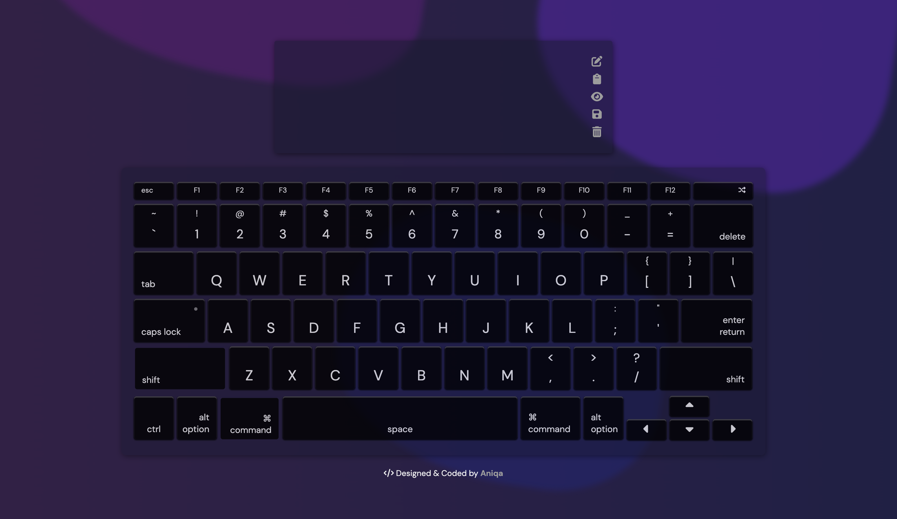
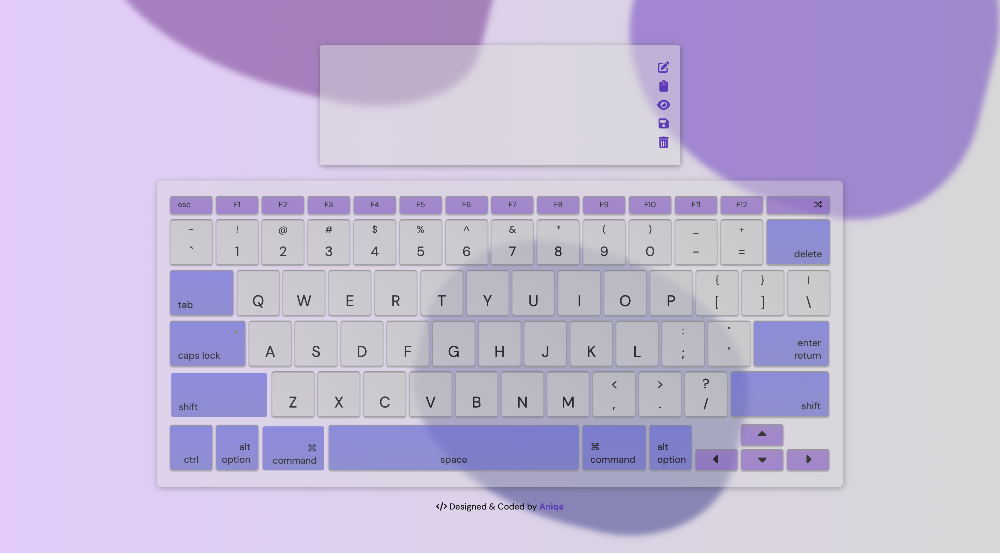
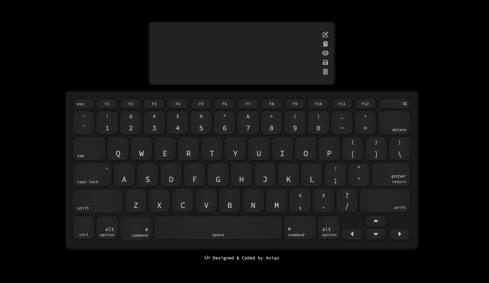
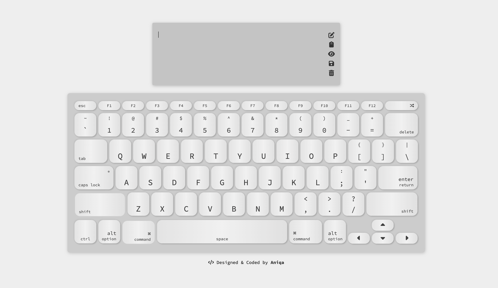
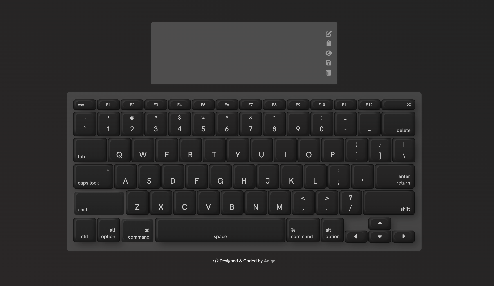
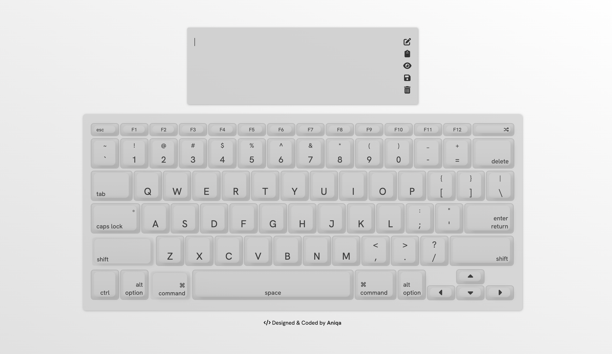
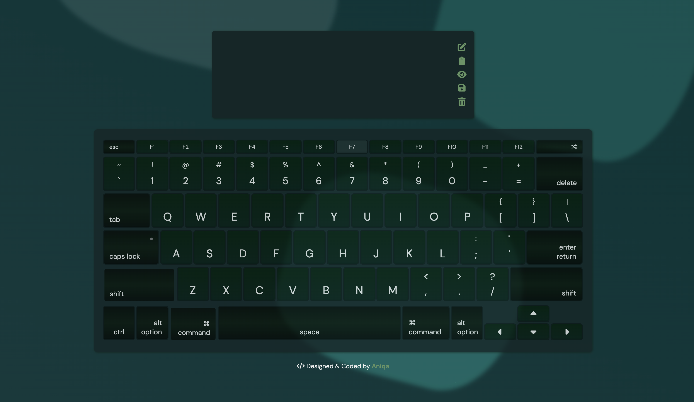
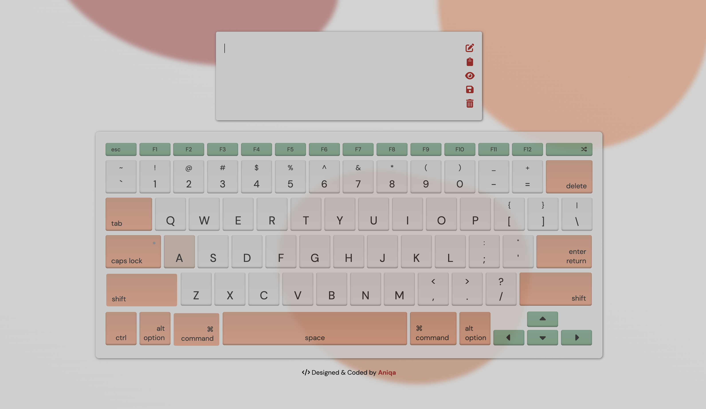

## Themed Keyboard w/ Markdown Preview

[https://keyboard.aniqa.dev/](https://keyboard.aniqa.dev/)

⌨️ A responsive virtual keyboard with 8 unique styles (and 2 different keyboard lighting animations) that triggers on mouse clicks and keyboard presses along with a text area to write, copy and save Markdown content. Utilizes localStorage to save the user's theme preference and any Markdown content.

### Themes

## Tech

- HTML5
- CSS3
- JavaScript
- Marked.js

## Key Features

**Design**

- Eight distinctive keyboard themes with different color palettes, active states and fonts
- Two different keyboard lighting animations that have different color schemes based on keyboard theme
- Subtle moving blob animation in the background for select themes
- 3D button design for select themes
- Button or keypress activates styling around the corresponding key that was pressed
- Custom styled textarea input with a toolbar that has icons that animate on hover
- Responsive on devices above 380 pixels; otherwise, message shown prompting user to view on larger device

**Interactive Elements** 

- Toast notification that appears for 5 seconds to prompt user to click `Escape`
- `Escape` (mouse-click or keypress) opens a modal with information about the webpage
- Shuffle button at the top-right corner shuffles to a random theme
- Clicks or keypresses for `F1` to `F8` changes the keyboard theme
- Clicks or keypresses for `F9` to `F10` starts a keyboard animation
- Any mouse-click or keypress will focus the textarea
- Textarea toolbar allows the following (in order):
 - Edit textarea
	- Copy to clipboard
	- Markdown preview
	- Save (to `localStorage`)
	- Delete
- Markdown written in textarea will render as rich text if the markdown preview button is clicked
- Keypress on `CapsLock` will make entire keyboard letters uppercased
- Keypress hold on `Shift` will make entire keyboard letters uppercased

**Behind-the-Scenes**

- `setTimeout` to remove the toast notification that shows at the start
- `setTimeout` to momentarily show a message when a button is clicked in the textarea to confirm their action 
- `localStorage` to save the user's last selected theme and any content written in textarea
- Use `navigator.clipboard` to allow user to copy textarea input to their clipboard
- Use custom `data-` attributes to match keypresses to the element in the HTML
- Specify how `Backspace`, `Enter`, `ArrowUp`, `Arrowdown` and `Tab` are supposed to work inside the textarea
- Animations done entirely through JavaScript by adding and removing classes at a delay — creating a sequential animation
- Audio triggered on mouse-clicks

## Future Features
- ☐ Improve existing animations
- ☐ Fix the 'callback hell' with the animation timeouts
- ☐ Add additional lighting animations to `F11` and `F12` 

## Themes

### Animations

### Theme 1

### Theme 2

### Theme 3

### Theme 4

### Theme 5

### Theme 6

### Theme 7

### Theme 8

