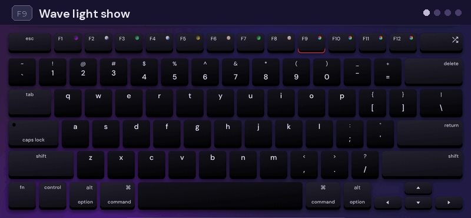
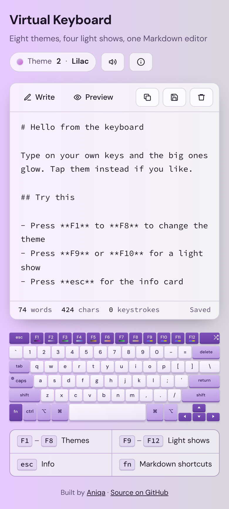

# Virtual Keyboard

**[keyboard.aniqa.dev](https://keyboard.aniqa.dev/)**

⌨️ A virtual keyboard with eight themes and four light shows, paired with a Markdown editor that previews as you type. It responds to clicks, taps and your real keyboard, works on phones, and remembers your theme and note.

<p align="center">
	<a href="https://keyboard.aniqa.dev" target="_blank"></a>
</p>

## Features

**Keyboard**

- Eight themes, each with its own colors, fonts, keycap style and glow
- Four light shows: a diagonal wave, a rainbow ripple from the center, a scanner sweep and random twinkles
- Mac-style layout with a function row, inverted-T arrow keys and a caps lock light
- Keys press down, spring back and glow in their row's color as you type
- Scales to any screen width, with short labels (`ctrl`, `⌥`, `⌘`) on small screens

**Shortcuts**

| Keys | What it does |
| --- | --- |
| `F1` – `F8` | Switch theme (the shuffle key picks one at random) |
| `F9` – `F12` | Start a light show |
| `esc` | Open the info card |
| `fn` | Turn on Markdown shortcuts: tap a labeled key for headings, bold, italic, links, lists, code and more |
| `Ctrl`/`⌘` + `B`, `I`, `K` | Bold, italic, link |
| `Enter` in a list | Continue the list; press it on an empty item to end the list |

**Editor**

- Write, Split and Preview views with a live Markdown preview
- Copy, save and clear (clear asks for a second press)
- Word, character and keystroke counts, autosave and an optional click sound

## Accessibility

- All text meets WCAG AA contrast (4.5:1) in every theme, including inside the info card and with the `fn` layer on
- The on-screen keyboard is a single Tab stop: arrow keys move between keys, `Home`/`End` jump to the ends of a row, and `Enter` or `Space` presses a key
- Every key has a screen reader name (`F1: Nebula theme`, `B, bold` when `fn` is on), and shift, caps lock, control and `fn` announce whether they're on
- Shift is shown with bold, underlined legends, not color alone
- Skip link, main landmark, and a scrollable preview you can reach with the keyboard
- The info card traps focus, closes with `esc`, makes the page behind it inert, and returns focus to where you were
- Icon-only buttons on phones keep their names for screen readers
- Light shows, theme changes and background motion respect the reduced-motion setting
- Supports Windows High Contrast and other forced-color modes, plus the system "increase contrast" setting
- Zoom is allowed

## Tech

- HTML, CSS and JavaScript (ES modules, no build step)
- [Marked](https://marked.js.org/) for Markdown and [DOMPurify](https://github.com/cure53/DOMPurify) to keep the preview safe

**Behind the scenes**

- Code is split into modules: `layout`, `keyboard`, `themes`, `editor`, `shows`, `modal`, `sound`, `toast` and `storage`
- Keys are generated from layout data and matched to presses with `KeyboardEvent.code`
- Themes are sets of CSS custom properties on `html[data-kb]`, applied before the first paint so there's no flash
- On-screen typing goes through `execCommand('insertText')`, so `Ctrl`/`⌘` + `Z` still undoes it
- Light shows use the Web Animations API and only animate opacity and transform, so they stay smooth on phones
- New themes spread out in a circle from the key you pressed (View Transitions API, where supported)
- The click sound plays through the Web Audio API, so fast typing doesn't cut it off
- `localStorage` access is guarded, so the site still works in private browsing

## Running locally

The scripts are ES modules, so open the site through a local server rather than the file directly:

```bash
npx serve .
# or
python3 -m http.server
```

## Future Features

- ✅ Improve existing animations
- ✅ Fix the 'callback hell' with the animation timeouts
- ✅ Add lighting animations to `F11` and `F12`

## Themes

### Theme 1 · Nebula
<a href="https://keyboard.aniqa.dev" target="_blank"></a>

### Theme 2 · Lilac
<a href="https://keyboard.aniqa.dev" target="_blank"></a>

### Theme 3 · Terminal
<a href="https://keyboard.aniqa.dev" target="_blank"></a>

### Theme 4 · Paper
<a href="https://keyboard.aniqa.dev" target="_blank"></a>

### Theme 5 · Graphite
<a href="https://keyboard.aniqa.dev" target="_blank"></a>

### Theme 6 · Chalk
<a href="https://keyboard.aniqa.dev" target="_blank"></a>

### Theme 7 · Forest
<a href="https://keyboard.aniqa.dev" target="_blank"></a>

### Theme 8 · Terracotta
<a href="https://keyboard.aniqa.dev" target="_blank"></a>

### On a phone
<p align="center">
	<a href="https://keyboard.aniqa.dev" target="_blank"></a>
</p>
