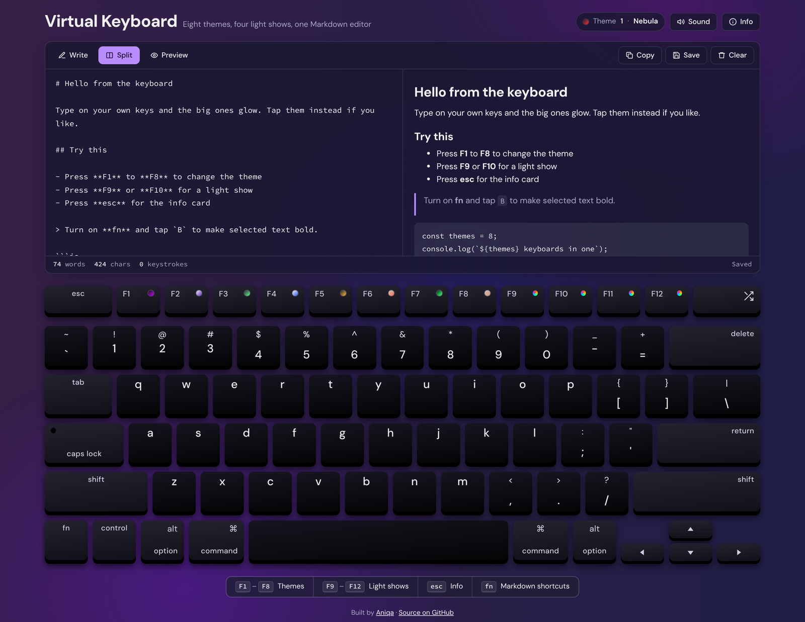
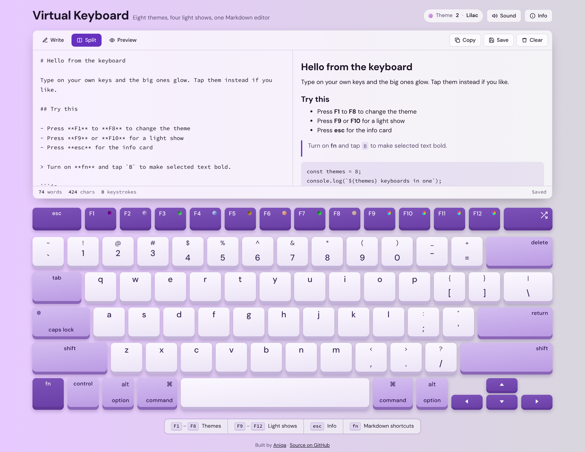
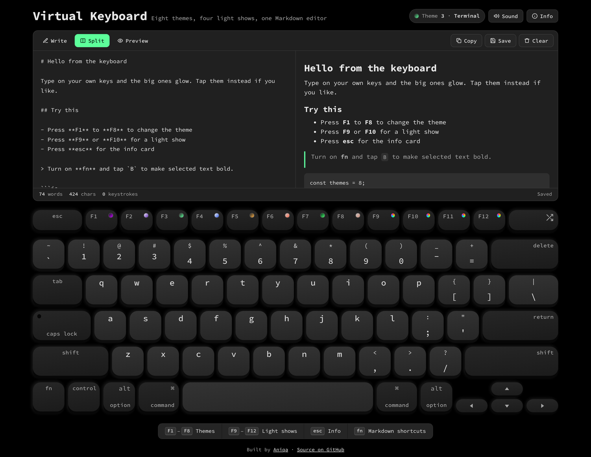
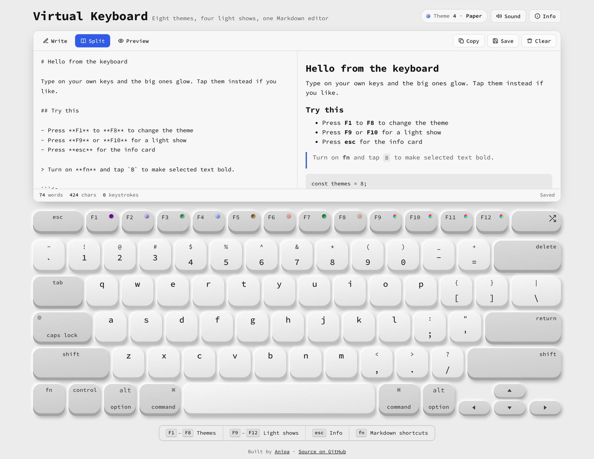
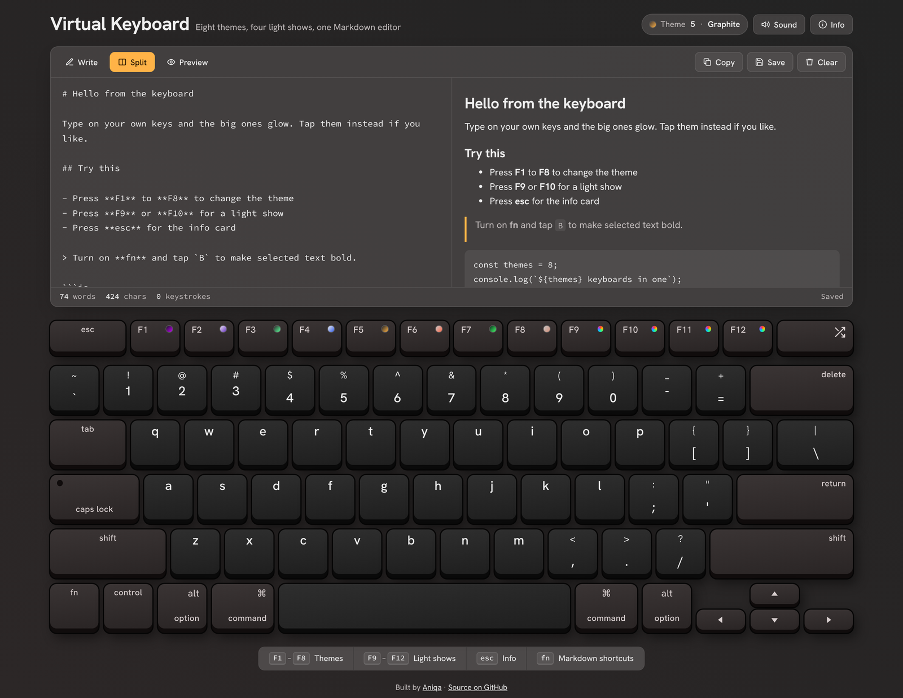
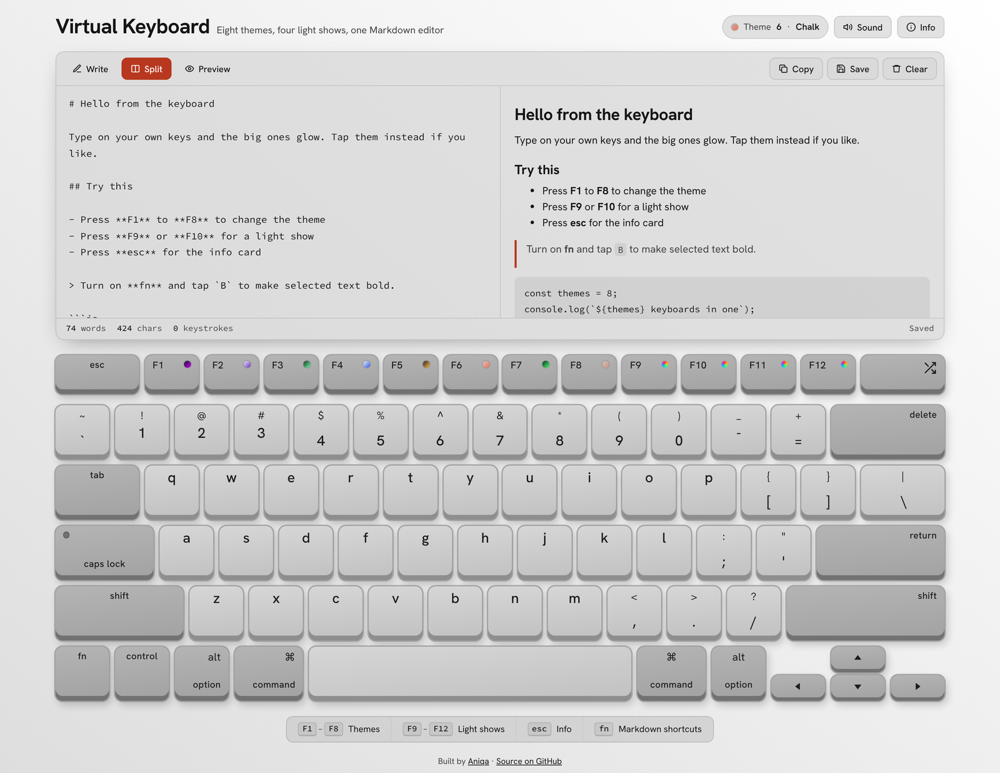
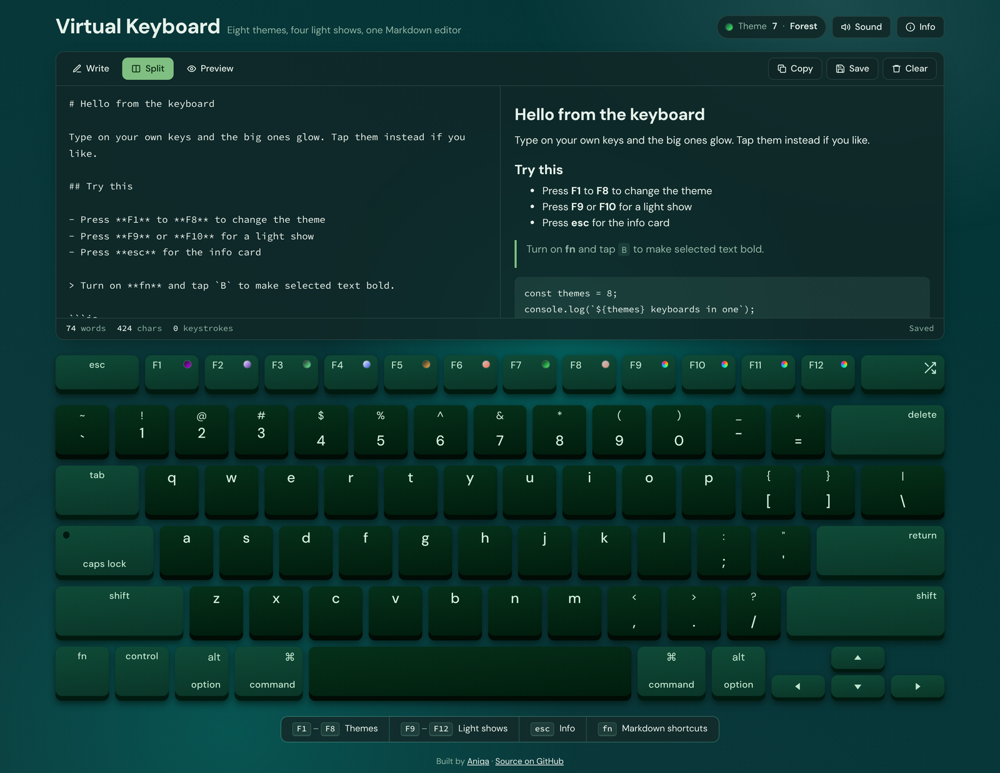
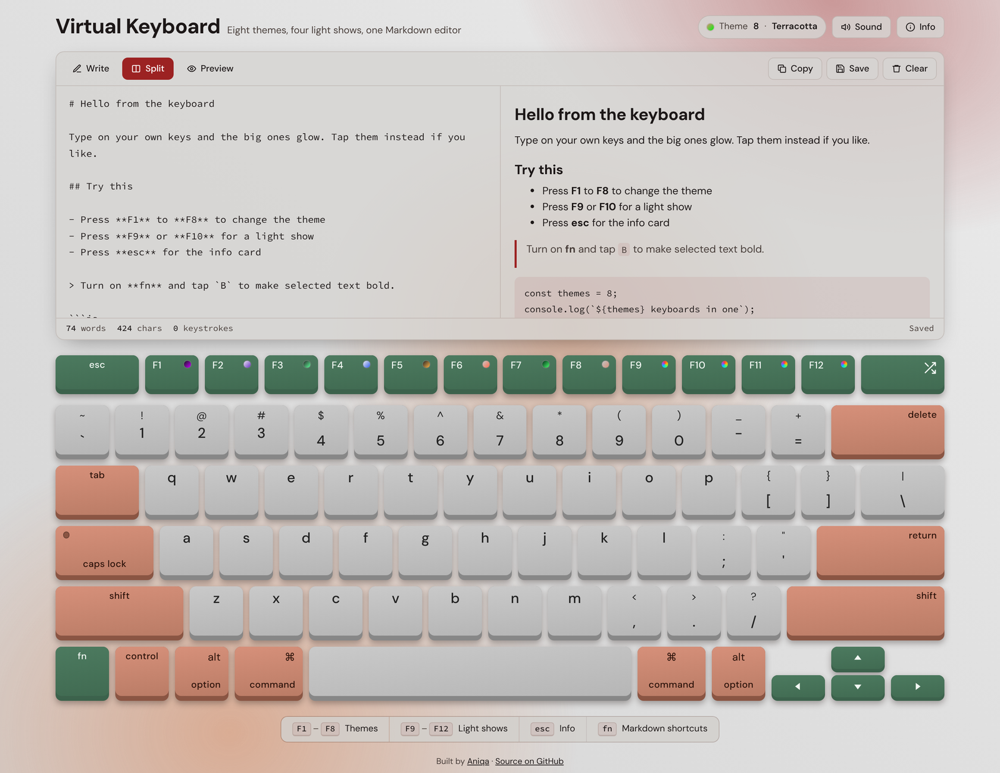

## Themed Keyboard w/ Markdown Preview

[https://keyboard.aniqa.dev/](https://keyboard.aniqa.dev/)

⌨️ A responsive virtual keyboard with 8 themes and 4 lighting animations that responds to mouse clicks, taps and key presses, paired with a Markdown editor with a live preview. Your theme and note are saved in `localStorage`.


### Themes
<p align="center">
<a href="https://keyboard.aniqa.dev" target="_blank"></a></p>


## Tech

- HTML5, CSS3 and JavaScript (ES modules, no build step)
- [Marked](https://marked.js.org/) for Markdown and [DOMPurify](https://github.com/cure53/DOMPurify) to sanitize the preview
- [Playwright](https://playwright.dev/) for end-to-end tests, run on GitHub Actions

## Key Features

**Design**

- Eight keyboard themes (Nebula, Lilac, Terminal, Paper, Graphite, Chalk, Forest, Terracotta), each with its own palette, fonts, key style and glow colors
- Four keyboard light shows: wave, ripple, sweep and twinkle
- Moving blob background on select themes
- 3D keycaps that press down and glow in their row's color
- Mac-style layout with a function row, inverted-T arrow keys and a caps lock light
- Scales to any screen width using container query units

**Interactive Elements**

- `F1` to `F8` (click or keypress) switch the theme; the shuffle key picks a random one
- `F9` to `F12` start a light show
- `Escape` opens an info card with a theme picker; `Escape` or the backdrop closes it
- Write, Split and Preview views with a live Markdown preview
- Copy, save and clear (clear asks for a second tap)
- `fn` layer: tap a key with a small label for a Markdown shortcut (headings, bold, italic, links, lists, code and more)
- `Ctrl`/`⌘` + `B`, `I` and `K` for bold, italic and links
- `Enter` continues bullet, numbered and task lists
- Shift and caps lock change the letter legends; on-screen shift applies to the next key only
- Word, character and keystroke counts, autosave, and an optional click sound

**Behind-the-Scenes**

- Code split into ES modules: `layout`, `keyboard`, `themes`, `editor`, `shows`, `modal`, `sound`, `toast`, `storage`
- Keys are generated from layout data and matched to presses with `KeyboardEvent.code`
- On-screen typing uses `execCommand('insertText')` so `Ctrl`/`⌘` + `Z` still works
- Themes are CSS custom-property sets on `html[data-kb]`, applied before first paint
- `localStorage` reads and writes are guarded so the site works in private browsing
- Click sound plays through the Web Audio API so fast typing doesn't cut it off
- Light shows run on the Web Animations API and only animate opacity and transform, so they stay smooth on phones; they respect reduced-motion settings
- Real `<button>` keys with labels, a focus-trapped dialog, and zoom left enabled

## Running locally

```bash
npm install
npm start          # http://localhost:4173
npx playwright install
npm test
```

## Future Features
- ✅ Improve existing animations
- ✅ Fix the 'callback hell' with the animation timeouts
- ✅ Add additional lighting animations to `F11` and `F12`
- ☐ Update the theme screenshots below for the redesign

## Themes

### Animations
<p align="center">
<a href="https://keyboard.aniqa.dev" target="_blank"></a></p>

### Theme 1
<a href="https://keyboard.aniqa.dev" target="_blank"></a>

### Theme 2
<a href="https://keyboard.aniqa.dev" target="_blank"></a>

### Theme 3
<a href="https://keyboard.aniqa.dev" target="_blank"></a>

### Theme 4
<a href="https://keyboard.aniqa.dev" target="_blank"></a>

### Theme 5
<a href="https://keyboard.aniqa.dev" target="_blank"></a>

### Theme 6
<a href="https://keyboard.aniqa.dev" target="_blank"></a>

### Theme 7
<a href="https://keyboard.aniqa.dev" target="_blank"></a>

### Theme 8
<a href="https://keyboard.aniqa.dev" target="_blank"></a>
