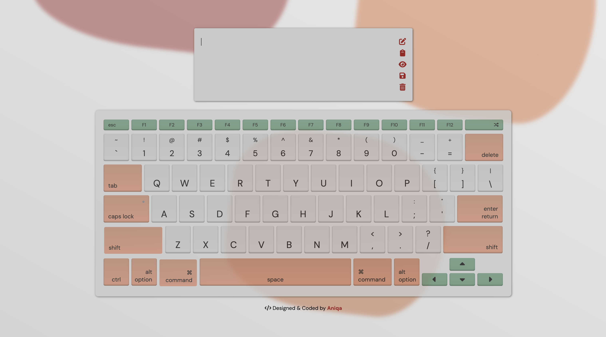

# <a href="https://keyboard.aniqa.dev" target="_blank">Themed Keyboard w/ Markdown Preview</a>
A fun, interactive virtual keyboard with <b>eight</b> unique themes (along with two full-keyboard animations) that can be accessed via keypresses or mouse clicks with the ability to add, edit, and save <b>Markdown</b> content in the input container. Fully responsive on screens above 380px and uses <code>localStorage</code> to save the user's theme preference and any Markdown or plain text written in input container.

 

# Key Features
I originally built the keyboard to practice utilizing keyboard events. However, once I got the first theme down, I couldn't stop adding additional features. Here's what I ended up with: 
- Interactive keyboard that triggers on touch (mobile), mouse clicks and keyboard presses
- Any text generated via keyboard or mouse clicks are added to the custom input container
- Input container has its own toolbar that provides a Markdown preview, copy-to-clipboard button, delete button and save button to keep any content for later (via localStorage)
- Eight unique themes can be accessed through clicking or typing through F1 to F8
- Two unique full keyboard lighting animations that can be accessed via F9 and F10
- Option to shuffle theme for a random one to be shown
- Automatically save user's theme preference to localStorage
- Click audio triggered by mouse clicks (since keyboards make sounds already, I've opted to leave it out for that)
- Subtle background animation of irregular shapes that are moving and changing in size
- Modal pop-up that appears when the Escape button is clicked to provide context and instructions for visitors
- Mobile responsive 

# Animations

# Theme One

# Theme Two

# Theme Three

# Theme Four

# Theme Five

# Theme Six

# Theme Seven

# Theme Eight

# Theme Changes

